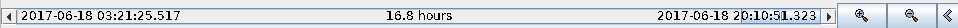
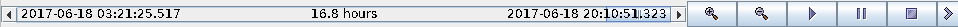

# JTimeScrollBar

## What?

Java Swing scroll-bar for scrolling through time.

On the scroll-bar the times shown are:
- Earlest time of currently visible region
- Duration of that region
- Last time of that region

Which also allows the time to be advanced automatically, i.e. play, pause, stop.

Only horizontal supported at the moment.

The icons are from a jar from Sun.  The License file in it reads:

Copyright 2000 by Sun Microsystems, Inc. All Rights Reserved.

Sun grants you ("Licensee") a non-exclusive, royalty free, license to use, and redistribute this software graphics artwork, as individual graphics or as a collection, as part of software code or programs that you develop, provided that i) this copyright notice and license accompany the software graphics artwork; and ii) you do not utilize the software graphics artwork in a manner which is disparaging to Sun. Unless enforcement is prohibited by applicable law, you may not modify the graphics, and must use them true to color and unmodified in every way.

## Why?

To help when rendering/controlling time-series data.  Also it can remove
the need for the controlled item/component to render the date(s) itself.

## How

Simple.  Subclass the BoundedRangeModel so it works with time values (Instance and Durations),
Subclass JScrollBar to use this type as its model.
Append painting to the control's rendering to render the dates at the limits.
Wrap it all up in a new panel which adds some control buttons to the right.

## To build

Wrap it all up in a jar.

I've supplied a build.gradle file, but I'm not at all expert with gradle,
so it may not be using the best gradle techinque.

## Where

I'm on the edge of a farm in sunny Surrey, UK.

## When

Started May 2017.

## Who?

mrp, aka martinp.
